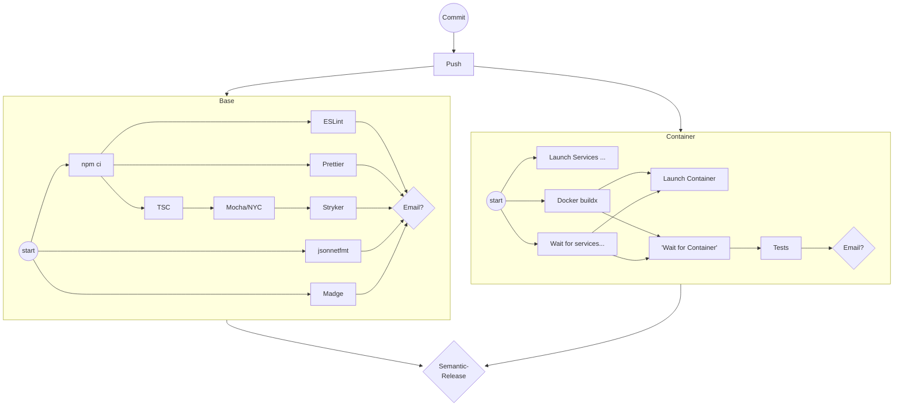
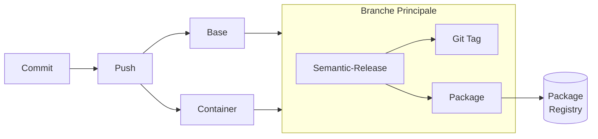
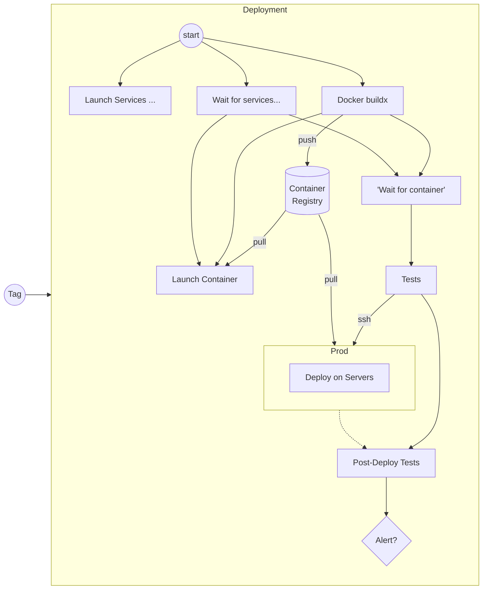
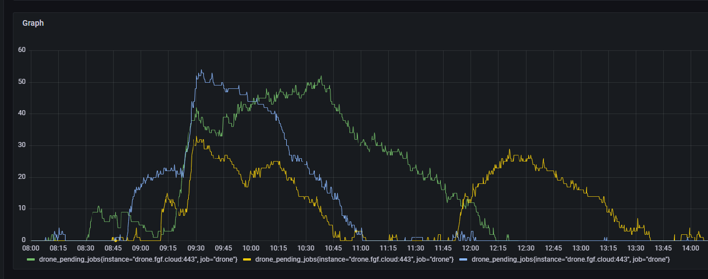

# CIngle Points of Failure

## Dark side of automation awesomeness

---

# $ whoami


(c) Discovery Channel

--

# <3 CI/CD/CD

Malgré toutes les erreurs d'implémentation présentées CI/CD/CD reste _best practice_

---

### JWST


---

# Sample Pipelines: CI



---

# Sample Pipelines: CDelivery



---

## Sample Pipelines: CDeployment



---

# Single Point of Failures

- Drone (CI / CD / CD / Secrets)
- Artifacts Storage:
    - Verdaccio
    - Artifactory
    - Docker Registry

--

## SPoFs: Artifact Storage

- Restart Services
- Disk Backup
- Rebuild Package Index from Tags

--

## SPoFs: Drone (CI / CDel / CDep / Secrets)

- CI: Pipelines as Code
- Secrets: Secrets Manager
- CD:
    - Artifact Storages
    - Missing Secrets
    - Firewalls
- Backups
- Tâches reproductibles

---

# CI fournit pas



--

## Upscaler Workers

- Azure F16s_v4 -> F32s_v4
- Ubuntu 18.04 LTS -> 20.04 LTS

--

```
$ sudo docker ps -a
CONTAINER ID   IMAGE   COMMAND   CREATED   STATUS   PORTS   NAMES
```

--

# Azure Linux VM Disk Layout

- /: 30 Go SSD
- /mnt: 100+ Go SSD **éphémère**
- /mnt/\<path\>: On Demand SSD

--

# Morale

- Bien connaître ses failure modes
- Vérifier ses backups

---

# Perdu

- Docker Services
- Docker Registry

--

## Re-remplir le registre

```bash
sudo docker image ls \
    --format '{{.Repository}}:{{.Tag}}' | \
    grep docker.fgf.cloud | \
    xargs -n1 sudo docker push
```

---

# Morales

- fstab clair
- Secrets Clairs
- Stop the world upgrades?
