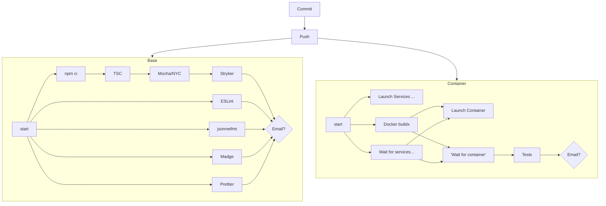
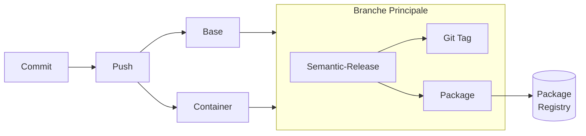
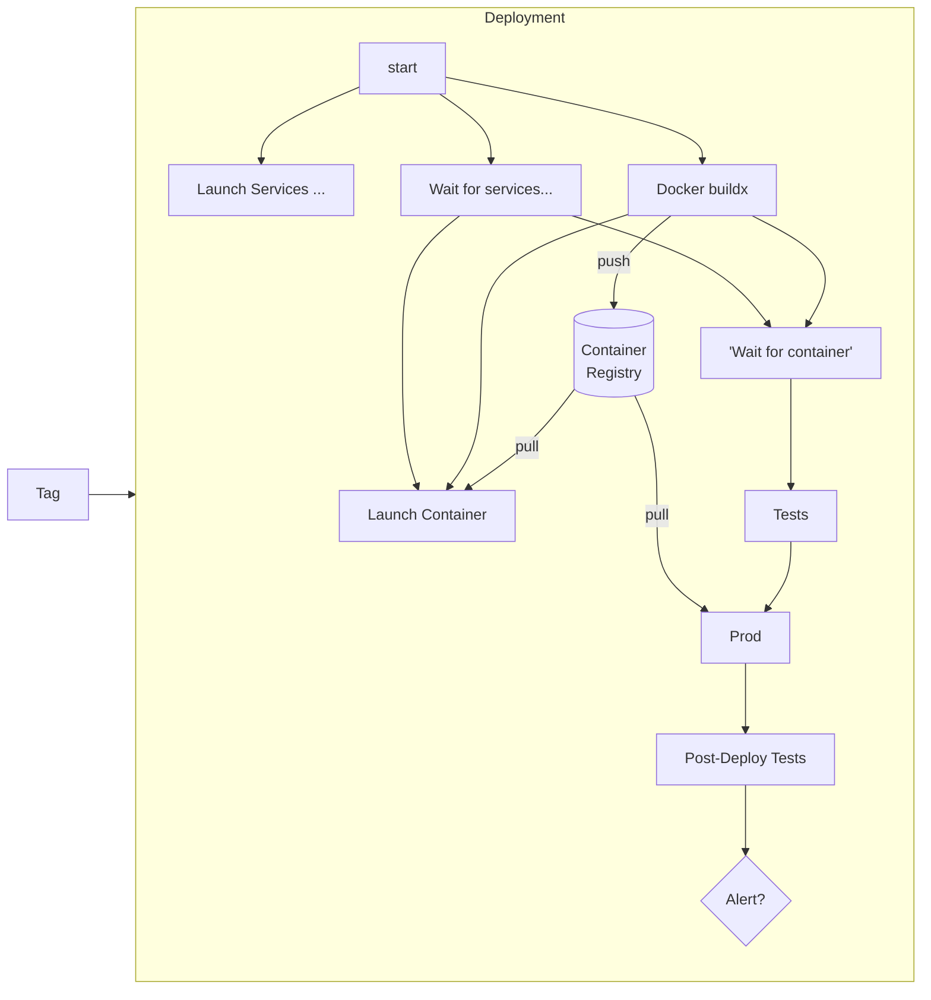

# CIngle Point of Failure

## Dark side of automation awesomeness

---

### ToC

---

# $ whoami

- Sample Pipelines
- SPoFs
- 

---

# <3 CI/CD/CD

Malgré toutes les erreurs d'implémentation présentées CI/CD/CD reste _best practice_

---

# Sample Pipelines: CI

---

# Sample Pipelines: C Delivery

---

# Sample Pipelines: C Deployment

---

# Single Point of Failures

- Drone (CI / CD / CD / Secrets)
- Artifacts Storage: Verdaccio/Artifactory
- Docker Registry

---

