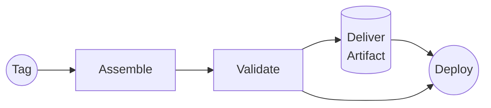
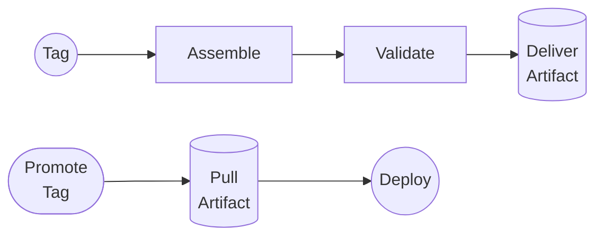
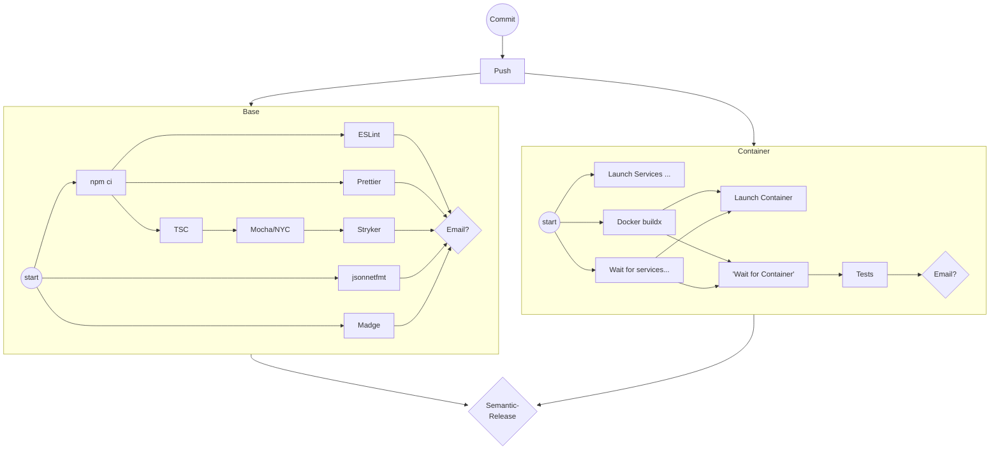
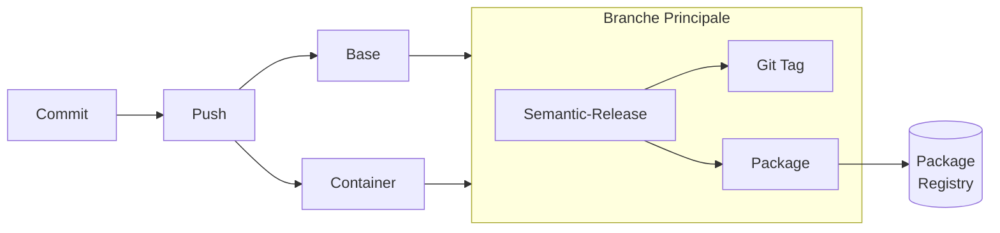
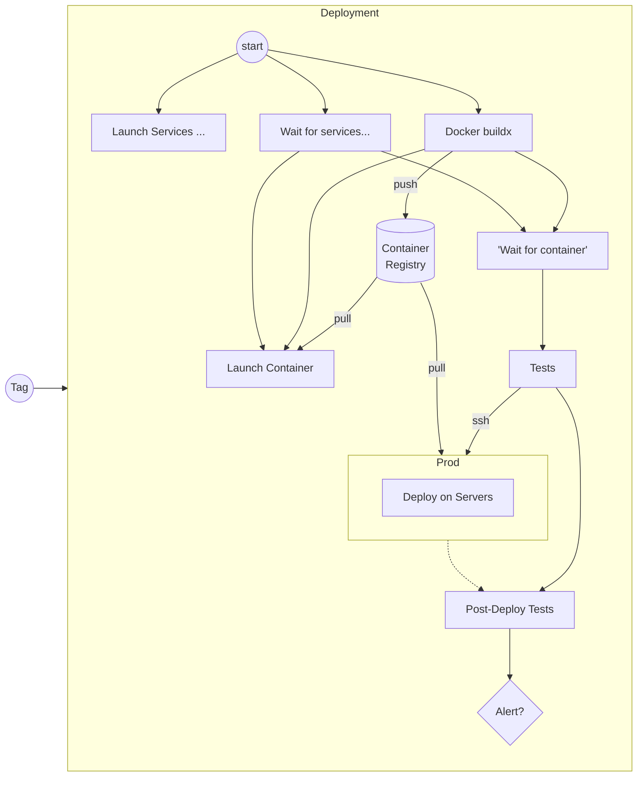

# CIngle Points of Failure

## Dark side of automation awesomeness

---

# $ whoami


(c) Discovery Channel

--

# <3 CI/CD/CD

Malgré toutes les erreurs d'implémentation présentées CI/CD/CD reste _best practice_

--

### JWST


---

# Timeline

- 5 juillet: OpenSSL Annonce 5 CVEs sous embargo
- 6 juillet: CI fourni pas
- 7 juillet: Date prévue du release de Node.JS patché
- 8 juillet 16h: Release des containers Node.JS

---

# CI fournit pas


--

## Upscaler Workers

- Azure F16s_v4 -> F32s_v4
- Ubuntu 18.04 LTS -> 20.04 LTS

--

## Qu'est-ce qui pourrait mal aller?

- Repartir les Services
- Disk Backup
- Reconstituer les artéfacts à partir des tags

--

```
$ sudo docker ps -a
CONTAINER ID   IMAGE   COMMAND   CREATED   STATUS   PORTS   NAMES
```

--

# Perdu

- Docker Services

--

# Perdu

- ~~Docker Services~~
- Docker Registry

---

## Re-remplir le registre

```bash
sudo docker image ls \
    --format '{{.Repository}}:{{.Tag}}' | \
    grep docker.fgf.cloud | \
    xargs -n1 sudo docker push
```

---

## Pipelines



--

## Pipelines



--

# Perdu

- ~~Docker Services~~
- ~~Docker Registry~~
- Build Database / History
- Secrets

--

### Build History

- Git contient encore les tags
- Drone crée un pipeline de tag à la **création** d'un tag

--

### Secrets

- AUTH0_CLIENT_ID
- AUTH0_MANAGEMENT_CLIENT_ID
- API_BACKEND_AUTH0_CLIENT_ID

--

### Secrets

- API_AUTH0_CLIENT_ID
- IDP_AUTH0_CLIENT_ID
- WEB_AUTH0_CLIENT_ID

---

# Perdu

- ~~Docker Services~~
- ~~Docker Registry~~
- ~~Build Database / History~~
- ~~Secrets~~
- Confiance des Devs
- Temps

---

# Azure Linux VM Disk Layout

- /: 30 Go SSD
- /mnt: 100+ Go SSD **éphémère**
- /mnt/\<path\>: On Demand SSD

---

# Questions?

---

# Sample Pipelines: CI



---

# Sample Pipelines: CDelivery



---

## Sample Pipelines: CDeployment


